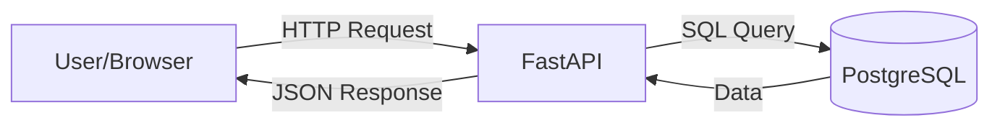

✅ Perfect I have fully understood the new course outline and requirements. I will now begin generating Chapter 1 of the **FastAPI + PostgreSQL + SQLAlchemy** course.

I will ensure each chapter is comprehensive, well-explained step-by-step, and followed by the required JSON assessment block. Starting now with Chapter 1.

---

# Chapter 1: Backend & FastAPI Fundamentals

## 🎯 Learning Objectives
By the end of this chapter you will be able to:
1.  Explain what an API is and how modern web communication works
2.  Understand RESTful architecture principles and HTTP standards
3.  Install and set up a professional FastAPI project environment
4.  Build your first working endpoint with path and query parameters
5.  Use automatic documentation tools for testing and sharing
6.  Compare FastAPI with Flask or Django to justify technology choices

---

> 💡 **Why This Matters**: Before writing complex database models or authentication logic, you must understand how clients communicate with servers. APIs are the backbone of modern software, powering everything from mobile apps to frontend websites. FastAPI represents the current state-of-the-art in Python backend development.

---

## 1.1 What is an API?

### Client-Server Architecture
Most modern applications follow a **Client-Server Model**:
-   **Client**: The thing that requests data (Web browser, Mobile app, Other server)
-   **Server**: The thing that provides data (Your FastAPI application)

### API Definition
API stands for **Application Programming Interface**. It is a set of rules that allows two software programs to talk to each other.
-   You define **endpoints** (URLs)
-   You send **requests** (JSON data)
-   You receive **responses** (JSON data)



---

## 1.2 REST Principles

REST (**REpresentational State Transfer**) is an architectural style for APIs. Not a strict standard, but a widely accepted convention.

### Key REST Concepts:
1.  **Resources**: Everything is identified by a URL (e.g., `/users/123`)
2.  **Stateless**: Each request contains all info needed. No session memory on server.
3.  **Uniform Interface**: Standardize how resources are accessed.

### Resources vs Endpoints
| Concept | Description | Example |
| :--- | :--- | :--- |
| **Resource** | The noun being accessed | Users, Orders, Products |
| **Endpoint** | The specific address | `/api/users`, `/api/orders/5` |

---

## 1.3 HTTP Methods & Status Codes

### HTTP Verbs (Methods)
These tell the server *what* you want to do with the resource.

| Method | Action | CRUD Equivalent | Safety |
| :--- | :--- | :--- | :--- |
| **GET** | Retrieve data | Read | ✅ Safe |
| **POST** | Create new data | Create | ❌ Unsafe |
| **PUT** | Update entire resource | Update | ❌ Unsafe |
| **PATCH** | Partial update | Update | ❌ Unsafe |
| **DELETE** | Remove data | Delete | ❌ Unsafe |

> ✅ **Rule of Thumb**: Always use GET to retrieve data without side effects. Never put sensitive actions behind GET.

### Common Status Codes
You must return these codes so the client knows what happened.

| Code | Meaning | When to Use |
| :--- | :--- | :--- |
| **200 OK** | Success | Standard successful response |
| **201 Created** | Resource Created | After POST request successfully |
| **400 Bad Request** | Invalid Data | Validation errors, bad JSON |
| **401 Unauthorized** | No Authentication | Missing token/login |
| **403 Forbidden** | No Permission | Logged in but can't access |
| **404 Not Found** | Resource Missing | User ID doesn't exist |
| **500 Internal Error** | Server Crash | Unhandled exception |

---

## 1.4 FastAPI Overview

FastAPI is a modern, fast (high-performance) web framework for building APIs with Python 3.8+ based on standard Python type hints.

### Why FastAPI Over Flask or Django?
| Feature | Flask | Django | **FastAPI** |
| :--- | :--- | :--- | :--- |
| **Performance** | Good | Slow (Monolithic) | ⚡ **Very Fast** |
| **Async Support** | Manual | Basic | ✅ **Native (Python async)** |
| **Validation** | Manual (Flask-WTF) | Built-in (Forms) | ✅ **Automatic (Pydantic)** |
| **Documentation** | Swagger (Manual) | Admin Panel | ✅ **Auto (OpenAPI/Swagger)** |
| **Learning Curve** | Easy | Steep | Moderate (Requires typing) |

> ✅ **The Killer Feature**: Type hints allow FastAPI to validate input automatically and generate interactive documentation instantly.

---

## 1.5 Project Setup

### Step 1: Directory Structure
Organize projects from day one for scalability.
```bash
/my_fastapi_project
├── main.py              # Application entry point
├── requirements.txt     # Dependencies
└── venv/                # Virtual environment (ignore in git)
```

### Step 2: Create Virtual Environment
Always isolate dependencies.
```bash
python -m venv venv
source venv/bin/activate  # macOS/Linux
venv\Scripts\activate     # Windows
```

### Step 3: Install Dependencies
```bash
pip install fastapi uvicorn[standard]
```
-   `fastapi`: The core framework.
-   `uvicorn`: ASGI server to run the application.

---

## 1.6 Your First FastAPI App

Create a file named `main.py`.

```python
from fastapi import FastAPI

# Initialize the app
app = FastAPI(
    title="My First API",
    description="Welcome to my awesome API",
    version="1.0.0"
)

# Define a root endpoint
@app.get("/")
def read_root():
    return {"message": "Hello, World!"}
```

### How to Run It
Start the development server using Uvicorn.
```bash
uvicorn main:app --reload
```
-   `main`: The filename (`main.py`)
-   `app`: The variable name inside the file
-   `--reload`: Auto-reload when code changes (Development only)

### Accessing the API
Open your browser to:
-   **Root**: `http://127.0.0.1:8000/` → Returns JSON
-   **Docs**: `http://127.0.0.1:8000/docs` → Interactive Swagger UI
-   **ReDoc**: `http://127.0.0.1:8000/redoc` → Clean alternative docs

---

## 1.7 Path Parameters

Use these when the parameter is part of the URL itself (identifying a resource).

```python
@app.get("/items/{item_id}")
def read_item(item_id: int):
    # item_id is automatically extracted and converted to integer
    return {"item_id": item_id}
```

### Usage
Visit: `http://127.0.0.1:8000/items/5`
Result: `{"item_id": 5}`

### Constraints
You can add constraints to path parameters.
```python
@app.get("/items/{item_id}?min_length=5")
def read_item(item_id: int, min_length: int = 5):
    ...
```

---

## 1.8 Query Parameters

Use these for optional filtering or search. They appear after a `?` in the URL.

```python
@app.get("/items/")
def read_items(skip: int = 0, limit: int = 10):
    """
    Return items with pagination.
    skip: Number of items to skip
    limit: Max items to return
    """
    return {"skip": skip, "limit": limit}
```

### Usage
Visit: `http://127.0.0.1:8000/items/?skip=10&limit=20`
Result: `{"skip": 10, "limit": 20}`

### Optional Query Params
If you don't specify the query param, it defaults to `None` or default value.
```python
@app.get("/users/{user_id}")
def get_user(user_id: int, include_details: bool = False):
    if include_details:
        return {"status": "details included"}
    return {"status": "basic info"}
```

---

## 1.9 Automatic Documentation (Swagger / ReDoc)

This is the single best feature of FastAPI. Because you used type hints, FastAPI auto-generates an interactive API schema based on **OpenAPI**.

### Features of Docs:
1.  **Swagger UI**: Try out every endpoint directly in the browser.
2.  **Schema Definition**: JSON Schema validation definition.
3.  **Request/Response Models**: Clear view of input/output shapes.
4.  **Security Schemes**: Automatically shown OAuth/JWT settings later.

### Generating Schema File
You can export the documentation to JSON:
```bash
curl http://127.0.0.1:8000/openapi.json > openapi-schema.json
```

---

## 1.10 Best Practices for Beginners

1.  **Naming**: Use verbs for operations (`create_user`, `get_users`).
2.  **Versioning**: Start with `/api/v1/...` even if version 1 only.
3.  **Error Handling**: Don't let raw exceptions escape to users.
4.  **Environment Variables**: Never hardcode secrets or URLs.
5.  **Logs**: Print important info during development to track execution flow.

---

## ✅ Chapter 1 Summary

You now have a solid foundation:
-   Understood **APIs** and the **REST** architecture
-   Learned **HTTP Methods** and **Status Codes**
-   Set up **FastAPI** and installed dependencies correctly
-   Created endpoints with **Path** and **Query** parameters
-   Leveraged **Automatic Documentation** for testing

You are ready to handle structured data in the next chapter with Pydantic!

---